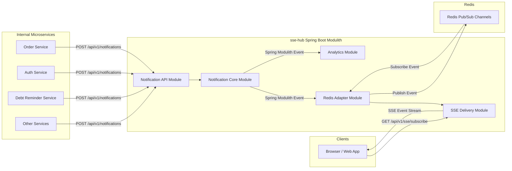
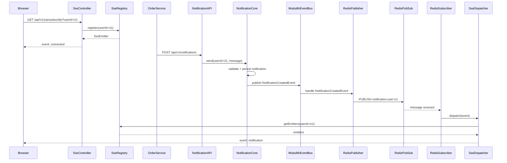

# sse-hub

A real-time notification delivery service built with **Spring Boot 4**, **Spring Modulith**, and **Server-Sent Events (SSE)**. Backends publish notifications via a REST API; browsers receive them instantly over a persistent SSE stream backed by Redis Pub/Sub for horizontal scalability.

## Architecture

### Component Overview



### End-to-End Flow



### Modules

| Module | Package | Role |
|--------|---------|------|
| `notification` | `com.nduyhai.ssehub.notification` | Persists notifications, owns lifecycle, publishes domain events |
| `sse` | `com.nduyhai.ssehub.sse` | Manages SSE connections via Reactor `Sinks`, heartbeat, delivery |
| `redis` | `com.nduyhai.ssehub.redis` | Bridges Modulith events to Redis Pub/Sub and back to SSE |
| `analytics` | `com.nduyhai.ssehub.analytics` | Listens to domain events for structured audit logging |
| `shared` | `com.nduyhai.ssehub.shared` | Open module: shared event records and common config |

Module boundaries are enforced by Spring Modulith. The `redis` module may only reference `shared` and the `sse.application` named interface.

## Tech Stack

| Component | Technology |
|-----------|-----------|
| Runtime | Java 25, Spring Boot 4.0.6 |
| Web | Spring WebFlux (Netty) |
| Modularity | Spring Modulith 2.0.6 |
| Persistence | Spring Data JPA, PostgreSQL 16, Flyway |
| Messaging | Redis Pub/Sub (`spring-boot-starter-data-redis`) |
| Distributed Lock | ShedLock 6.9.1 with Redis provider |
| Containers | Docker Compose (auto-managed by Spring Boot) |

## API Reference

### Subscribe to notifications

```
GET /api/v1/sse/subscribe?userId={userId}
Accept: text/event-stream
```

Returns a persistent SSE stream. The first event is `connected`. The server sends `heartbeat` events every 30 seconds to keep the connection alive.

### Send a notification

```
POST /api/v1/notifications
Content-Type: application/json

{
  "userId": "user-123",
  "message": "Your order has been shipped.",
  "type": "ORDER_UPDATE"
}
```

Returns `201 Created` with the persisted notification ID and status.

## Local Development

### Prerequisites

- Java 25+
- Maven 3.9+
- Docker (for Compose-managed PostgreSQL and Redis)

### Run

```bash
./mvnw spring-boot:run
```

Spring Boot auto-starts Docker Compose on launch (PostgreSQL on `5432`, Redis on `6379`). Flyway runs migrations automatically.

### Build

```bash
./mvnw clean package
```

### Test

```bash
# All tests
./mvnw test

# Single test class
./mvnw test -Dtest=SseHubApplicationTests

# Verify Spring Modulith module structure
./mvnw test -Dtest=ModularityTests
```

Tests use Testcontainers; Docker must be running.

## Configuration

Key properties in `application.yml` (all overridable via environment variables):

| Property | Default | Description |
|----------|---------|-------------|
| `ssehub.scheduler.retry-delay-ms` | `60000` | Retry interval for undelivered notifications |
| `ssehub.sse.heartbeat-interval-ms` | `30000` | Interval between SSE heartbeat events |
| `spring.datasource.url` | `jdbc:postgresql://localhost:5432/ssehub` | PostgreSQL URL |
| `spring.data.redis.host` | `localhost` | Redis host |
| `spring.data.redis.port` | `6379` | Redis port |

## Horizontal Scaling

Each pod subscribes to the Redis pattern `notification:user:*`. When a notification is published, every pod receives it and checks whether the target user has a local SSE connection — only the pod holding the connection delivers the event. This means the service scales out without a shared in-memory registry.

The retry scheduler is protected by a ShedLock distributed lock (`retryPendingNotifications`) backed by Redis, ensuring only one pod runs the retry job at a time regardless of deployment size.
